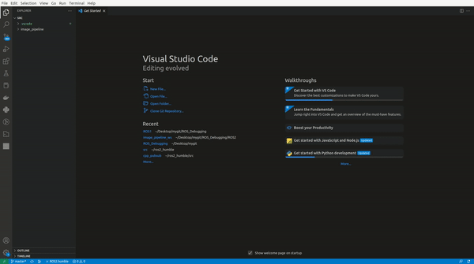
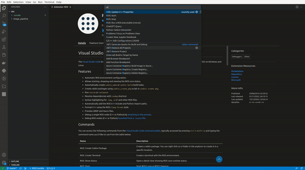
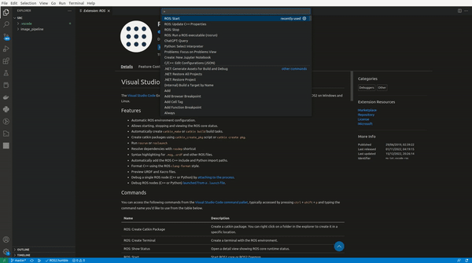
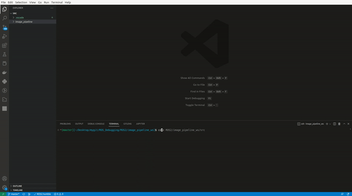
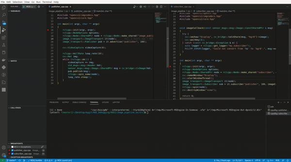

# ROS Debugging
This repository offers a sample VScode-based debug pipeline for ROS nodes and launch.

### Install ROS VScode Plugin


* Open VS Code.
* Click on the "Extensions" icon in the left sidebar (it looks like a box with an arrow pointing up).
* In the search bar at the top of the "Extensions" panel, search for "ROS".
* You should see the "ROS Extension for Visual Studio Code" in the search results. Click the "Install" button to install the extension.
* After the extension has finished installing, you may need to restart VS Code for the changes to take effect.

### Start ROS Daemon


The keyboard shortcut Ctrl+Shift+P opens the Command Palette. Search for ROS:Start and click. This will start the ROS daemon.

### Update ROS C++ Properties


Search for ROS:update c++ Properties and click. This will create .vscode directory with cpp_properties and settins.json file.

The .vscode directory is a special directory that can be used to store configuration files for a Visual Studio Code (VS Code) project. The cpp_properties.json and settings.json files are two common configuration files that can be used in the .vscode directory.

<b>cpp_properties.json</b> is a configuration file that specifies the settings for a C++ project in VS Code. It can be used to specify the compiler path, include paths, preprocessor definitions, and other C++-specific settings. Here is an example of a cpp_properties.json file:

```json
{
  "configurations": [
    {
      "browse": {
        "databaseFilename": "${default}",
        "limitSymbolsToIncludedHeaders": false
      },
      "includePath": [
        "~/ros2_humble/install/*", 
        # and other files as well  
      ],
      "name": "ROS",
      "intelliSenseMode": "gcc-x64",
      "compilerPath": "/usr/bin/gcc",
      "cStandard": "gnu11",
      "cppStandard": "c++14"
    }
  ],
  "version": 4
}
```

<b>settings.json</b> is a configuration file that specifies the global settings for a VS Code workspace. It can be used to specify various editor and environment settings, such as the font size, tab size, and default language. Here is an example of a settings.json file:

### Create Debug Launch File

* From the VScode menu, select the "Debug" option.
* Click on the "Create a launch.json file" button.
* Select "ROS: Launch File" from the list of debug configurations.
VScode will create a launch.json file in the .vscode folder of your project.

* In the launch.json file, you can specify the ROS nodes that you want to run when the launch file is executed. To do this, you can use the program field.
```json
{
    "version": "0.2.0",
    "configurations": [
        {
            "name": "ROS: Launch",
            "type": "ros",
            "request": "launch",
            "target": "${workspaceFolder}/image_pipeline/launch/publisher_launch_cpp.py"
        }
    ]
}
```

### Put break point and Run code in debug mode


* To set a breakpoint in VScode, simply click on the left gutter of the editor (the area to the left of the line numbers) at the line of code where you want to set the breakpoint. This will place a red dot in the gutter, indicating that a breakpoint has been set.

* You can also set a breakpoint by hovering your mouse over a line of code and pressing the F9 key.

* To enter debug mode in VScode, you can use the "Debug" option from the menu, or you can use the F5 key. This will launch the VScode debugger and execute your program.

* Once in debug mode, you can use the debugger controls in the top menu to pause the execution of your program (using the "Pause" button), step through your code line by line (using the "Step Over" and "Step Into" buttons), or continue running your program until the next breakpoint is reached (using the "Continue" button).

* You can also use the VScode debugger to inspect the values of variables at any point in your code, by hovering your mouse over a variable or by using the "Watch" window in the debug panel.

